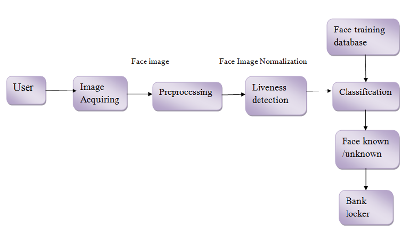
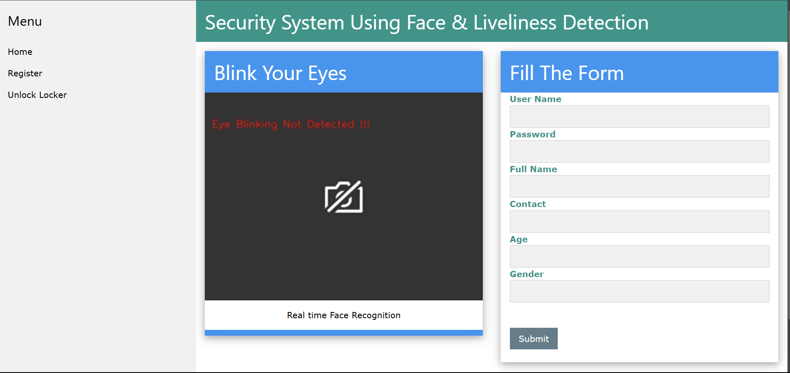
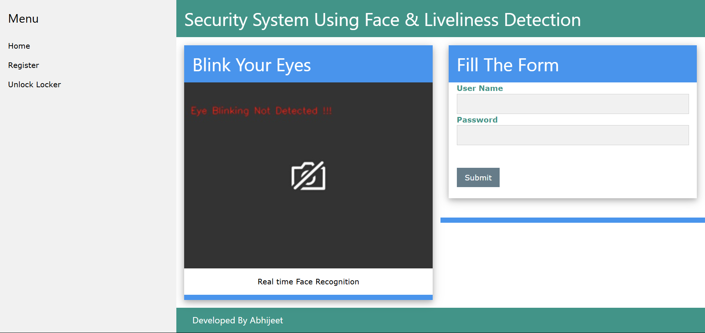

# Security System Using Face Liveliness Detection

This project aims to build a security system that uses face detection and liveliness detection techniques to authenticate users. The primary objective is to verify whether a detected face belongs to a real person and not an image or video, thereby enhancing security and preventing spoofing attacks.

## Table of Contents

* [Project Overview](#project-overview)
* [Tech Stack](#tech-stack)
* [Project Architecture](#project-architecture)
* [Features](#features)
* [Setup and Installation](#setup-and-installation)
* [Usage](#usage)
* [Dataset](#dataset)
* [Results](#results)

## Project Overview

In this project, we implemented a face liveliness detection system using a combination of traditional image processing and deep learning techniques. The system can be used for security purposes such as logging users in, monitoring access, and preventing unauthorized access to restricted areas.

The core idea is to detect the face and classify it as "live" or "spoofed" using the developed model.

## Tech Stack

* **Programming Language** : Python
* **Web Framework** : Flask
* **Deep Learning Library** : TensorFlow, OpenCV
* **Face Recognition** : dlib, face-recognition, pyzbar
* **Machine Learning Algorithms** : CNN, LBPH (Local Binary Patterns Histograms)
* **Face Detection** : Haar Cascade Classifier
* **Database** : SQLite or MongoDB (based on project requirements)
* **Docker** : Containerization of the application

## Project Architecture

### A. Model Framework

The proposed system combines **Dlib** with liveliness detection. The model uses a **Haar Cascade Classifier** to detect faces in real-time. Once the face is detected, the system determines whether the face is real or fake using a liveliness detection technique.

Liveliness detection differentiates between live and non-living features. The key goal is to detect faces and eyes in real time. Here, the **Haar Cascade Classifier** is employed for object detection tasks like face and eye detection. This classifier is a machine learning-based algorithm for detecting objects in images or videos.

### B. Architecture Diagram

The architecture involves implementing **eye-blink detection** and **face recognition** using the **LBPH** algorithm. This system operates through a real-time video feed from a camera. Below is the sequence of tasks performed:

1. **Face Detection** : The system identifies faces in each frame captured by the camera using the Haar Cascade Classifier.
2. **Eye Detection** : For each detected face, the system checks for eyes.
3. **Liveliness Detection** : Verifies whether the eyes are blinking to ensure the detected face is live.
4. **Face Recognition** : Identifies the recognized face using LBPH and provides access to the corresponding users locker or security system.

   

## Features

* **Real-time Face Detection** : Detects faces in real-time using a webcam feed.
* **Liveliness Check** : Ensures the detected face is not a static image or video but a live person.
* **Face Recognition** : Recognizes known faces and logs their access.
* **Database Integration** : Stores user details and logs access attempts.
* **Web Interface** : A simple web interface for monitoring access and checking logs.
* **Flask Monitoring Dashboard** : A monitoring tool to keep track of API performance.

## Results

Register Page

Unlock Page

